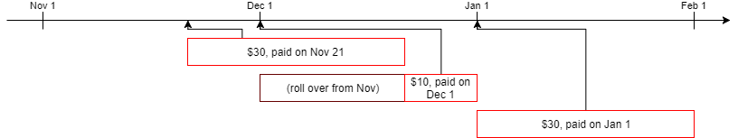

Open letter to Patreon
====

Dear Patreon,

Recently you have [announced changes to the Patreon fee structure](https://blog.patreon.com/updating-patreons-fee-structure/). Changes that are supposed to help creators. I want to talk about them, in the form of an open letter.

I am not a creator myself. However I believe that these changes will affect creators in a negative way, therefore I think my feedback ought to be heard.

I apologize for this document reaching essay-length, but there's a lot to be said about it.

---

I am a huge believer in crowdfunding. I have a Kickstarter Superbacker status with 283 projects backed. I participated on other crowdfunding platforms such as IndieGoGo, Fig, GoFundMe. I am convinced that crowdfunding is a great modern tool with a lot of potential.

I have been with Patreon as a patron since June 2014. Over those 3.5 years, I have put $2732.50 into Patreon ― to support, mostly without any form of exclusive compensation, creators I want to see succeed and thank for their contributions.

That included a period when I was unemployed and uncertain about my future ― and yet, I couldn't bring myself to outright cut support for everything I love. I definitely had to carefully trim my spending, but it never drastically stopped.

**This changed today.** After your announcement, my participation dropped from 23 creators and $50/mo to 4 creators and $22/mo. As you can see from those figures, I trimmed all of my smaller pledges ― with a public apology and explanation to every creator as to why I am doing it. I am considering reducing it even more.

Before I go into why I decided to do so, and why I think it's inevitable that others do the same, let me start with the theory behind Patreon as a platform, at least as I see it.

Patreon: the concept
---

In the modern digital world, smaller content creators are disadvantaged. Their creations are, by their very nature, subject to a lack of scarcity. People consuming them normally don't need to pay upfront ― otherwise, a creator can't reach and grow an audience. Even if there is a paywall to some content, piracy is easy for digital assets.

Still, it does not mean that creators must go without compensation. Ad support is one such model, but it's annoying to consumers and doesn't scale well for small audiences. Add to that the widespread adoption of ad blocking mechanisms, and it becomes even more unreliable.

There can be premium products alongside the free ones ― such as physical merchandise. There are plenty of platforms for merchandise, but a significant number of potential patrons doesn't want this form of support: production, shipping and taxes can eat up a lot of money, physical things require space to store them, and require a substantial investment from the buyer for little profit to the creator. Digital premium goods avoid this problem, but it's still a one-off purchase, resulting in unpredictable income for the creator.

Alongside that, there have always been people who were ready to give their money to simply support creators of their choice, with no expectations of rewards other than a warm fuzzy feeling of helping. The problem, of course, is setting this up. Becoming a beneficiary of payments that are easy for other people to use is hard. Not many platforms do this, PayPal being a notable player in the field. However, you have high transaction fees per each payment, which scale badly at the low end of the spectrum. Anecdotally, paying something like $1 over and over can run into negative income for the receiver due to fees. Add to that the fact that PayPal is infamously fickle in how it decides to handle incoming money ― possibly blocking it with little recourse.

Setting up recurring payments ― a holy grail of predictability for creators ― is yet another can of worms. Smaller recurrent payments run into comparatively higher fees, wasting everyone's resources to the profit of payment processors. Many problems, with no clear solutions.

At the time, crowdfunding ― with Kickstarter as the torchbearer ― was taking off in a major way. It allowed small-time creators to create premium products with little upfront budget without reliance on traditional publishing platforms. However, it was unsuitable for two of the purposes stated above: recurrent payments and donation-type payments. There was no big crowdfunding platform that would meet those requirements (at least, not with a focus on being a network of content creators).

Until, in 2013, along comes Patreon.

---

The premise (and promise) of Patreon from the outset was pretty simple: to help patrons willing to provide support and creators connect to each other in a way beneficial for both.

Patreon provides **a trusted platform, backed by its reputation,** to host campaigns to support creators. It's possible to do this with or without rewards offered in flexible ways.

It's a valuable communication tool that works both ways, connecting creators and their fans.

The platform enjoys transparency, with patrons being able to estimate the level of support a creator is already getting (though we are now learning just how unpredictable the nature of creator fees was).

It enjoys a network effect: once "onboarded", **a patron is likely to pledge for other creators on the same platform due to drastically reduced friction.**

Finally, there's an important financial incentive. There are still external processing fees for putting money in and out of Patreon, but they are mitigated by aggregating payments: a patron is billed once a month for all supported campaigns, and creators similarly cash out the aggregated earnings. This drastically **reduces the "$1 is eaten up by fees" problem,** enabling people to meaningfully support a lot of creators with little money. It's a viable financial alternative to being ad-supported. Many a small-pledge patron is guided by "I'm using AdBlock but can still fully cover the loss with just $1". **This is an absolutely key point of Patreon,** and everybody wins as a result.

**This changed today.** Now everybody loses. I initially thought that you, the company, would win by cashing in more fees than before. Now that I read your blog update, I see that, literally, everybody loses.

Patreon: the troubles
---

The system described above functioned well for the most part. Except for one problem: people being frauds.

A pledge is just that: a _promise_ to pay later. However, Patreon immediately unlocks the tangible rewards. This opens the door to promising to pay, collecting rewards, and ending up not paying.

Let me note at this point that **rewards should not be the focus of Patreon to begin with.** They were always extra nice things next to the main purpose of supporting the creator. Not all campaigns even offer any ― some deliberately state that knowing you're supporting the creator is the only reward. However, it is understandable that such exclusive rewards are desirable and drive the participation. And it only makes sense to get access immediately.

Okay; this is a valid problem. You came up with a solution of an optional **Charge Up Front (CUF)** mode. This guarantees at least one full cycle of payment by charging it immediately. But, as you noted in the blog post, this leads to an anomaly: no matter where you pay in your first month, you pay the whole amount for that part, followed by a full amount again on next calendar month. It can get as bad as paying a full month's price for one day if you pledge on the last day of a month.

**This is both confusing and unfair. I would not disagree!** However, your proposed solution isn't really fixing either of those problems, at least not from the patron perspective.

CUF troubles: an attempted solution
---

You propose to charge every such pledge on its own monthly schedule, separate from other pledges. Furthermore, you propose to make this non-optional, and shift transaction fees onto patrons.

The current system, outside of the odd "initial" pledge payment, provides a good overview of how much you're spending per month. It's easier to plan expenses around one payment per month. With your new system, patrons will be flooded with payment notifications throughout the month. Do you really think this is going to be less confusing?

Now on to fairness. Your new schema destroys the financial advantage of Patreon: this no longer avoids per-transaction fees. This generally raises fees that go to external providers, **benefiting no-one involved: neither patrons, nor creators, nor you as a company.** This is money burned on the altar of our financial system ― the very one crowdfunding is supposed to disrupt.

In addition, some people already pay per-transaction fees, like currency exchange fees, that can rise with unbundling into separate payments ― even if you didn't charge the flat rate.

Furthermore, this destroys viability of many small pledges.. Something that is the bread and butter of smaller campaigns and campaigns that don't offer rewards. Is that fair to everyone involved?

Your new system prioritizes larger pledges to fewer campaigns. Which makes you pick which campaigns make most sense for larger pledges.. Which is, of course, campaigns with rewards. **This really pushes away creators who specifically don't want to put out exclusives / paywalls on their content.** This increases pressure on creators to make exclusive content over their regular content. This becomes less about support and more a premium content storefront. Is that fair to creators? Does that mesh with your [original vision](https://www.patreon.com/about)?

Making it punishing to set multiple small pledges kills the network effect as well. You do not have incentives to look into supporting smaller creators you discover once you're on the platform. Every pledge you make punishes you a little more for spreading your money.

---

Now, don't misunderstand. I don't think fees are possible to eliminate. **You do provide a valuable service, and you do incur costs to yourself processing payments. To compensate you for this is fair and expected.** However, how to apply those fees differs in perception and fairness.

First off, let's see your current situation. No fees to patrons (except for occasional VAT). Variable, invisible fees for creators upwards of 7% (up to 15%). This is not optimal, especially since it makes hard for creators to predict their income. However, this is fully predictable to patrons and enjoys the very simple rule of **"more patrons means more income for the creator",** even if the relationship is not linear.

Your new scheme: variable fees for patrons, fixed (but still non-zero) fee for creators. Pros: creators have (on paper) predictable income. Patrons have a predictable (but confusing) cost.

It is confusing, but fair, to impose costs onto the patrons. A fixed percentage is ideal ― predictable, and doesn't matter if you support 10 creators for $1 or just one but for $10. **I would personally agree to pay that.** Realities of payment processing also mean that per-transaction fee is unpleasant, but fair (someone just pledging $1 once causes higher fees). But then unbundling doesn't make any sense. A flat fee per month for a patron reflects necessary evil, but **unbundling causes arbitrary extra fees ― and personally, this is the thing I vehemently oppose.**

Further, this complicates life for patrons. If a patron wants to pay $10 to creators a month, how much will he actually be billed? **This no longer has a simple answer,** since it depends on the split. If your goal was to reduce confusion, this is not helping.

And for what? Solving **just one problem** of overcharging CUF patrons? Can there not be a better way? I posit that there can be.

CUF troubles: an alternative solution
---

Let's collect assumptions as to why CUF is necessary and what properties do you want from the system.

[1] A creator has put a value on certain rewards (which is the monthly cost of the tier). If someone is getting that reward, the creator wants to guarantee that at least this much is paid.

This excludes pro-rating the first payment. The first payment must be at least 1 month.

[2] A patron should never pay more than expected for the time he has access to rewards, e.g. not paying 2 months worth for 1 month + a day from your example.

This is the problem with the current system that you want to eliminate. 

There's one more implicit assumption:

[3] A patron should not pay for more than one month in advance at any point.

This excludes the solution "pay for 1.5 months initially if you start in the middle of a month". First payment must not be more than one month, and therefore must be _exactly_ one month.

So, what solution can fit all of the above, plus still use bundling as currently implemented? Here's one.

---

Suppose that in a 30-day month (say, November), a new patron pledges on the 21st. They already missed 2/3 of a month, yet, by [1], are expected to pay a full price. Let's assume the perk costs $30/mo.

**On Nov 21st, the new patron is charged $30, buying a month of access.**

Then, billing for December comes up, say, Dec 1st. We want to recalibrate the system so that next time, the patron pays with usual calendar month system.

The first payment covered the last 1/3 of November, leaving 2/3 of a month pre-paid by December. Just include that into calculations by rolling over the "unspent" time!

**On Dec 1st, the patron is billed ($30 - 2/3\*$30) = $10, setting their pre-paid period until the end of December (a month in the future, so [3] is fine).**

After that, the patron is on regular cadence. **They pay the expected $30 every month starting with January.**

The system fits all 3 criteria above, and still bunches up all payments except for the initial CUF one ― same as current one. That is, if the creator decided to use that at all. If they don't want that ― and some don't really need it since they have no tangible perks ― it's even easier for you and cheaper for the patron.

---

I can foresee an objection to this schema: "too complicated". Your initial blog post specifically bemoans that "creators and patrons are confused in our current system".

I'm sorry, but this is somewhat insulting to our intelligence as users. Same as not initially disclosing your reasoning behind your new fees, by the way.

Here's how my alternative solution can be explained at checkout, taking my example numbers and dates:

> **Here's what you will pay, unless you cancel your pledge:**
> 
> $30 will be charged right now for a month of access (Nov 21st – Dec 20th).
>
> $30 will be charged at the beginning of each* month thereafter until you change or cancel your pledge.
>
> \* Next month, you'll receive a one-time discount due to the initial pledge rolling over (you'll be billed $10 for Dec 21st – Dec 31st).

Note that I'm not an expert in presentation. People getting confused is a [UX problem](https://en.wikipedia.org/wiki/User_experience), not necessarily a problem with the underlying system. Consider consulting external experts on the matter, instead of blaming the system.

The fallout
---

I can speculate endlessly as to what approach to the problem would be better, but what's done is done: you announced the intent to implement your version of changes. This has an immediate negative impact which has to do with **both perception and reality of it.**

Perception first. The new fee system means that every patron's bill is going to increase, without any interaction and without any _clearly visible_ positive effect.

Consider: the actual amount going to creators may increase, but from a patron perspective the cost of a $5 reward is now ($5 + fees), or ~$5.5. Getting more money to creators is a good thing, but the minimum entry fee changed upwards ― and creators budgeted for the fees anyway. Multiple creators I used to support are now saying they will _lower their pledge level costs to compensate_. But a lower pledge level only exacerbates the fees..

Of course, it is to be expected that this bill hike is **perceived like a hostile action.** More so with the initial lack of explanation, which made it seem like pure greed.

Next, take the fact that you're not eliminating fees for the creators entirely. You collect fees from _both_ patrons and creators. Both ostensibly to run the service. Regardless of the reality of how those costs are split, this can be and is **seen by some as double-dipping.**

Small pledges are now in a hard spot. Your flat fee is perceived as a tax ― a tax too high to justify for some, who are dropping pledges on principle.

And then there are hard realities. A lot of people participating on Patreon have **budget ceilings.** Some will choose to reduce their pledges in a way that their total bill is still within that budget. This means less money for creators, and for you.

Lowering the fees for creators will not be a net positive if the raw support drops.

I am **yet to see anyone outside Patreon itself who looks at your plan and thinks "this is a good idea".** This should be a wake-up call for you that, perhaps, you're doing something wrong.

This results in **lasting reputation damage to your platform.** Instead of the friendly, to-go choice for creator support, you're now seen as a necessary evil. Unobtrusiveness of the platform is gone, you're now very visible and your role is questioned. You are losing goodwill of your customers.

---

This situation makes you **bleed patrons, money, and eventually creators** if the situation does not improve. Right now, alternatives to your platform are not mature, but a loud chorus of disgruntled patrons is repeating "when you have an alternative set up, I'll support you that way".

With the flat fee introduction you're starting to lose competitive advantage over just paying creators directly, processing fees be damned. With your system money is split between payment providers, you and the creator. **You can be taken out of this picture.**

You're giving potential competitors (e.g. Kickstarter Drip) a perfect opportunity to strike while the public opinion is critical of you. Niche solutions with subscriptions (e.g. Twitch for video content creators, Picarto for artists, etc.) will gain more prominence. And it will stay that way if you don't open the debate ― and by that I mean also open yourselves to entertain alternative options.

Remedies / conclusions
---

Regardless of the path you take now, it will be hard to win back the trust of your users. I am but one of them, but here's my view on what you can do to improve.

1. **Stop, and listen.** It should be clear from the reaction you are getting that your plan needs adjustment, re-framing, or scrapping. **The first step should be to postpone the plan.** You, and the users, need time to assess the situation ― **don't let it go into effect in 10 days.** [Edit: To clarify, per-creation payments from December 18th on [will follow the new rules](https://patreon.zendesk.com/hc/en-us/articles/115005631963#patron)]

2. **Take another look at your data, taking into account the reaction you're getting.** You're bleeding off pledges, especially small pledges, as a result of the changes. Extrapolate. Is this sustainable for your creators if you lose a big chunk of $1-$2 pledges?

3. **Run a large-scale survey of your users.** Clearly you did not anticipate the reaction you got, meaning you don't understand what matters to them. Obviously, running a business is not a democracy.. But it can be argued that it's a monarchy, with customer being the king. So mass opinion matters.

4. Whatever changes you implement, **unbundling payments is a terrible idea** that simply leads to loss of patron money. Simplicity isn't worth a burden on all parties involved. Please reconsider.

5. Should you decide to impose fees on patrons, **make sure they scale fairly.** Hitting lowest-contribution patrons harder is not healthy for the ecosystem. Discouraging patronage of multiple creators through per pledge fees is absolutely **against the very idea of Patreon as a platform.**

6. Both creators and patrons are split on their opinion of who should bear the fees. **Consider making that flexible.** A lot of creators currently say that they would love to bear the cost. Some patrons that have the resources would say the same.

7. **Communicate important changes early and clearly. Engage with the community.** A lot of the flak you're receiving right now could be avoided if you presented your reasoning right away, instead of letting us speculate as to whether this is greed-motivated. It would be even better if this was not presented as a matter of fact, but as a matter for debate.

I hope this document finds its way into the right hands, and will not be brushed aside. I am passionate about Patreon and what it enables creators to do (otherwise this letter wouldn't be written), and as such I would love to see this situation resolve in a positive way.

However, if it does not.. Nature abhors a vacuum.

Regards,  
Alexander Kashev.

---

_This open letter will be sent to the CEO of Patreon, Jack Conte, to the Patreon Support as feedback, as well as publicly announced at least on Twitter and Patreon._

_It will be publicly displayed at https://kav2k.github.io/patreon_letter_

_I can be reached at `alexander [at] kashev.me` or on Twitter: [@kav2k](https://twitter.com/kav2k)._

---

This letter was originally published on 2017-12-08. It has undergone 1 revision since then (mostly to correct a few typos).  
I apologize for any errors remaining (I am, after all,  not a native speaker).  
You can see the original version that got sent to Jack Conte at [this revision](https://github.com/kav2k/patreon_letter/blob/ce294447b78a9e9177206dfe04ac0f7d5a2c386a/README.md).